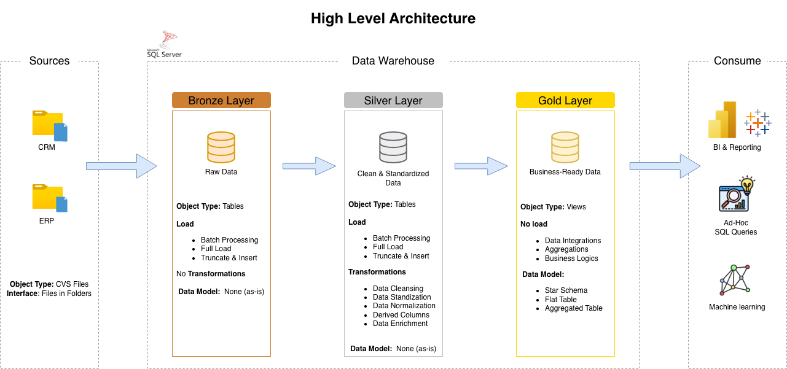

# 🏗️ Data Warehouse and Analytics Project

Welcome to the **Data Warehouse and Analytics Project** as part of the SQL Full Course from ***Data with Baara***

## 📌 Overview

This project demonstrates the design and implementation of a modern data warehouse using Microsoft SQL Server running in a Docker container. The solution consolidates sales data from multiple source systems to enable analytical reporting and data-driven decision-making.

The data warehouse integrates data from CRM and ERP systems, transforms raw datasets into a structured format, and delivers business-ready insights through a star schema model.

---

## 🎯 Objectives

* Consolidate data from CRM and ERP systems into a unified data warehouse
* Clean and resolve data quality issues prior to analysis
* Build a user-friendly analytical data model
* Enable reporting on customer behavior, product performance, and sales trends
* Provide clear documentation for both business and technical stakeholders

---

## 🏗️ Architecture

The project follows the **Medallion Architecture** approach:

<p align="center">
  
</p>

### 🥉 Bronze Layer (Raw)

* Stores raw data ingested directly from source systems (CSV files)

### 🥈 Silver Layer (Cleaned)

* Performs data cleansing and standardization
* Handles missing values, inconsistencies, and formatting issues
* Applies normalization to prepare data for modeling

### 🥇 Gold Layer (Business-Ready)

* Implements a **star schema** optimized for analytical queries
* Contains fact and dimension tables for reporting

---

## ⚙️ Tech Stack

* Database: Microsoft SQL Server (Dockerized)
* Client Tool: Azure Data Studio
* Containerization: Docker
* Language: SQL

---

## 🔄 ETL Pipeline

The project implements an ETL process:

1. **Extract**

   * Import data from CRM and ERP CSV files

2. **Transform**

   * Clean and standardize data
   * Resolve inconsistencies and data quality issues
   * Prepare datasets for analytical modeling

3. **Load**

   * Load transformed data into dimension and fact tables

> Note: This project focuses on the **latest dataset only**. Historical tracking (SCD/historization) is not implemented.

---

## 📊 Data Model

The Gold layer follows a **star schema design**:

* **Fact Tables**

  * Sales fact table (transaction-level data)

* **Dimension Tables**

  * Customer dimension
  * Product dimension
  * Date dimension

This structure enables efficient querying and supports analytical use cases.

---

## 📈 Analytics & Reporting

SQL-based analysis is used to generate insights, including:

* Customer Behavior Analysis
* Product Performance Evaluation
* Sales Trend Analysis

These insights support business decision-making and performance tracking.

---

## 📁 Project Structure

```
├── data/                # Raw CSV files
├── sql/
│   ├── bronze/          # Raw data ingestion scripts
│   ├── silver/          # Data cleaning and transformation
│   └── gold/            # Star schema and analytical models
├── docs/                # Data model documentation
└── README.md
```

---

## 🔥 Key Learnings

* Designed a data warehouse using Medallion Architecture
* Built ETL pipelines using SQL
* Developed a star schema for analytical workloads
* Worked with containerized SQL Server environments
* Improved data quality through transformation and validation

---

## 📌 Future Improvements

* Implement historical tracking (Slowly Changing Dimensions)
* Add orchestration (e.g., Airflow)
* Migrate to cloud platforms (AWS or GCP)
* Build dashboards using BI tools (e.g., Power BI, Tableau)

---

## 📄 License

This project is licensed under the MIT License.
You are free to use, modify, and distribute this project.

---

## 👩‍💻 About Me

Hi! I'm Anoutsala (Sara) Hanmonty, a graduate from UC Berkeley.
I currently work as an analyst and am actively working toward becoming a data engineer.

I am seeking opportunities in data engineering where I can apply my skills in data modeling, ETL pipelines, and analytics.
